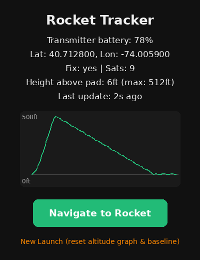
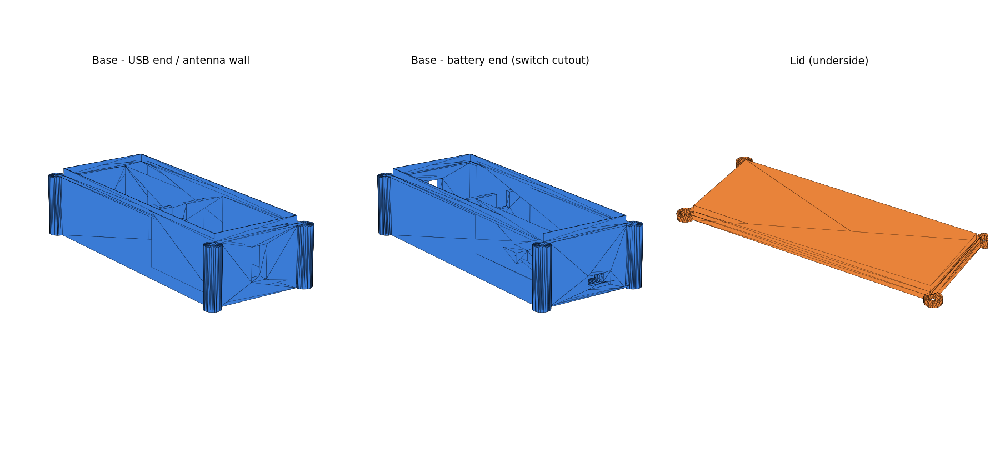

# Rocket Tracker — Setup Guide

Two sketches:

- `rocket_transmitter/rocket_transmitter.ino` — flashes onto the **Adafruit Feather M0 + RFM95 LoRa (900MHz) + GPS FeatherWing** stack. Lives in the rocket.
- `rocket_receiver/rocket_receiver.ino` — flashes onto the **Meshnology N30 (ESP32-S3 + SX1262)**. Handheld unit.

Both sketches have been compile-verified against the real toolchain (Adafruit SAMD core + esp32 core, RadioLib/TinyGPSPlus/U8g2) — zero errors, zero warnings. Compilation only proves the code builds, though, not that it works on real hardware — do the bench test in step 6 before anything goes near a launch pad.

## 1. Install Arduino IDE

Download from arduino.cc if you don't have it already (2.x recommended).

## 2. Install board packages

**File > Preferences > Additional Board Manager URLs**, add both (comma-separated, or one per line depending on your IDE version):

```
https://adafruit.github.io/arduino-board-index/package_adafruit_index.json
https://raw.githubusercontent.com/espressif/arduino-esp32/gh-pages/package_esp32_index.json
```

The Adafruit URL is required for the transmitter's board — without it, "Adafruit SAMD Boards" won't show up in Boards Manager at all.

Then **Tools > Board > Boards Manager**:

- Install **"Adafruit SAMD Boards"** (for the transmitter)
- Install **"esp32" by Espressif Systems** (for the receiver)

## 3. Install libraries

**Tools > Manage Libraries**, install:

- `RadioLib` (Jan Gromeš) — used by both sketches
- `TinyGPSPlus` (Mikal Hart) — transmitter only
- `U8g2` (oliver) — receiver only

## 4. Flash the transmitter

1. Plug the Feather M0 (with the GPS FeatherWing already stacked on top) into USB.
2. **Tools > Board** → select "Adafruit Feather M0"
3. Select the right **Port**
4. Open `rocket_transmitter.ino`, hit Upload
5. Open Serial Monitor at 115200 baud — you should see it printing GPS status. Note: it'll report `fix=0` indoors/near windows until it gets a clear sky view; GPS can take 30 seconds to a few minutes on a cold start.

## 5. Flash the receiver

1. Plug the Meshnology N30 into USB-C.
2. **Tools > Board** → select "ESP32S3 Dev Module"
3. Select the right **Port**. If you want Serial Monitor output over the same USB-C cable, also set **Tools > USB CDC On Boot > Enabled** (this board uses ESP32-S3's native USB, so without this setting the serial output has nowhere to go).
4. Open `rocket_receiver.ino`, hit Upload
5. The OLED should light up and show "Waiting for signal..." — if it stays blank, see the pin troubleshooting note below.

## 6. Test on the bench before flying

1. Power both boards up near each other.
2. The transmitter's onboard LED should blink briefly once per second (each successful send).
3. The receiver's OLED should update with lat/lon once the transmitter has a GPS fix — try this near a window or outdoors, GPS won't get a fix indoors.
4. On your phone, connect to WiFi network `RocketTracker` (password `findmyrocket`), then open `http://192.168.4.1` in a browser. You should see the coordinates and a green "Navigate to Rocket" button — tapping it always opens Google Maps (the app if it's installed, otherwise the website), regardless of phone.
5. Walk the transmitter away from the receiver in a straight line to get a rough real-world range estimate before your first launch. Don't assume the spec-sheet range — trees, buildings, and antenna orientation all matter.

## Altitude

GPS gives you altitude for free alongside lat/lon, so the receiver now shows it two ways:

- **Height above pad** — the receiver treats the *first* valid fix it ever receives as ground level, then reports everything after that as a delta from it. This is far more useful mid-search than raw GPS altitude (which is Mean Sea Level, an unfamiliar number tied to your local elevation, not the rocket's).
- **Max height reached** — since altitude is already streaming in every second, tracking the highest value seen is essentially free apogee tracking, no separate altimeter needed.

**This means the transmitter needs to be powered on while the rocket is already sitting on the pad, before launch** — that's the moment its GPS altitude becomes the "zero" baseline. Both the OLED and the web page show "H:" (height above pad) and "Max:" once a baseline is set; before that, they fall back to showing raw MSL altitude.

Two honest caveats: GPS altitude is less accurate than horizontal position — commonly off by 30-50 feet without differential correction — so treat this as a rough estimate, not a precision altimeter reading. Also, the baseline and max height both reset if the receiver reboots, so if you're running multiple flights in a day, power-cycle the receiver right before each new launch to re-zero it.

Everything shown to you — on the OLED, the web page, and in this guide — is in feet. Internally the GPS and the radio packet still use meters (that's what GPS hardware natively reports), the conversion just happens once, right before anything gets displayed.

### Live altitude graph



*Illustrative mockup with sample flight data, not a real device screenshot — shows roughly what the web page looks like once you have a flight logged.*

The web page also draws a running graph of height-above-pad for the whole flight so far — no separate app, it's a plain HTML5 canvas the receiver draws itself, since the phone has no internet access while connected to the receiver's hotspot (a CDN-hosted charting library just wouldn't load). The graph, the max-height reading, and the altitude baseline all reset together — either by power-cycling the receiver, or by tapping **New Launch** at the bottom of the web page, which is the faster option if you're running multiple flights in a day.

The receiver keeps up to 30 minutes of altitude history per flight (one point per second, ~7KB of RAM — this board has hundreds of KB free, so it's not a real constraint). If a flight somehow runs past that, new points stop recording rather than erasing the earlier ones, so you still keep the actual ascent/descent profile instead of losing it.

## Battery status

The transmitter's battery level shows up on the receiver's screen and web page ("TX Batt: 82%"), so you can check "is there plenty of charge for this flight" before you walk out to the pad. The Feather M0 measures its own LiPo voltage (built into the board, no extra hardware) and rides it along in every LoRa packet it already sends once a second — this works from the moment it powers on, even before GPS gets a fix, since it doesn't depend on GPS at all.

This is a LiPo voltage estimate (single-cell, nonlinear discharge curve), not a lab-grade fuel gauge — treat it as "plenty," "getting low," or "charge before flying," not a precise number. A reading below 20% shows a "!" next to it on the OLED and highlights red on the web page.

There's no equivalent reading for the receiver's own battery. That was tried (reading the ESP32-S3's own battery-sense pin locally, no radio needed) and removed: on a real N30 unit, that pin measured a flat 0V on a multimeter even with a fully-charged, healthy battery connected — the sense signal simply isn't wired through to that pin on this board, and no firmware fix could work around it. If you want to check the receiver's own battery, a multimeter across the JST connector is the reliable way (a healthy single-cell LiPo reads roughly 3.7-4.2V).

## Power (receiver)

The receiver has no physical power switch, but it does have two buttons, and only one of them is usable for this:

- **PRG (top button)** is wired to a real GPIO (GPIO0). Hold it for 1 second and the receiver shows "Powering down..." then drops into deep sleep - LoRa radio, OLED, and WiFi hotspot all powered down to a few microamps. Press PRG again and it wakes up with a full reboot, same as a fresh power-on.
- **Reset (bottom button)** is hardwired straight to the chip's reset line in hardware. It never passes through your code, so it can only ever do an instant hard reboot - it can't be used as a sleep/wake button.

Use PRG to put the receiver to sleep whenever it's not in use, so the battery isn't draining on the shelf between launches. The transmitter doesn't have this option - it needs a physical inline switch or battery disconnect if you want to store it powered off, since the Feather M0 only has a hard reset button.

## Confirming what's actually flashed

Two different timestamps, two different jobs:

- **The `Version:` line at the top of each `.ino` file** is stamped with when the source was actually last pushed (e.g. "pushed 2026-07-26 03:07 UTC"), visible the instant you open the file in the editor - no compiling needed. This is "when was this code actually written," which matters if you write code and don't get around to flashing it until hours or days later.
- **"Firmware built: Jul 25 2026 14:32:10"**, printed to Serial Monitor at boot and filled in automatically by the compiler, is "when was THIS PARTICULAR UPLOAD compiled" - i.e., what's actually running on the board right now. The receiver also shows its build date on the OLED splash screen for a few seconds at boot, so you can confirm it without a laptop plugged in.

If those two ever disagree by more than a few minutes, it means you edited the source after the last time you compiled and flashed - a nudge to re-upload before you trust what's on the board.

## Things to double-check / likely friction points

- **Pin mapping on the receiver.** The code uses the standard Heltec WiFi LoRa 32 V3 pin layout (LoRa on SPI pins 8–14, OLED on I2C pins 17/18, Vext power-gate on pin 36). The Meshnology N30 is built on that same architecture, but since it's a clone, cross-check against the pinout diagram on the product listing before your first flash. If the OLED stays blank or the radio fails to initialize, this is the first place to look.
- **Frequency/region.** Both sketches default to 915MHz (US). If you're outside the US, change `LORA_FREQ_MHZ` to `868.0` in **both** sketches, and make sure the antennas you bought match that band.
- **Sync word, spreading factor, bandwidth, coding rate** must be identical on both sketches — they already are by default, just don't change one without the other if you tune settings later.
- **GPS cold start.** First fix after power-on can take a couple minutes. Don't launch until the transmitter's serial output (or a blinking pattern you add) confirms `fix=1`.
- **Antenna orientation matters more than people expect** for LoRa range — keep both antennas vertical and don't wrap the transmitter's wire antenna around anything metal.
- **RadioLib version.** Both sketches were written against the current RadioLib API (v6.x). If you already have an older RadioLix installed, update it via Library Manager first.

## 3D-printed transmitter case



`enclosures/transmitter_case.scad` is a parametric [OpenSCAD](https://openscad.org) enclosure for the transmitter stack: a pocket for the Feather M0 + GPS FeatherWing, a bay for the 500mAh LiPo, a USB cutout for flashing/charging, an exit slot for the antenna, and a panel-mount cutout for an inline power switch spliced into the battery lead (the transmitter has no on/off switch of its own — see "Power (receiver)" above for why one helps here too). Base and lid screw together with 4x M3 self-tapping screws through the corner ears.

**Read the comments at the top of the file before printing.** The board/header/connector dimensions come from Adafruit's published specs, not calipers on your actual hardware, so a few things (USB cutout position, antenna slot position, mounting-hole spacing) are best-effort estimates with generous built-in clearance. Print the base first, test-fit your actual boards and battery, and nudge the relevant variable at the top of the file if something's off before printing the lid.

To use it: open the file in OpenSCAD, set the `part` variable near the top to `"base"` or `"lid"`, press F6 to render, then export as STL — do this once for each part. Leaving `part` set to `"both"` just previews them side by side.

## Packet format (for reference, if you want to extend this later)

Both sketches share this 19-byte struct — keep them in sync if you add fields:

```c
struct RocketPacket {
  uint32_t seq;          // increments every packet
  float    lat;
  float    lon;
  float    alt_m;
  uint8_t  sats;
  uint8_t  fixValid;     // 1 = GPS fix valid, 0 = no fix yet
  uint8_t  battPercent;  // transmitter's own battery estimate, 0-100
};
```
